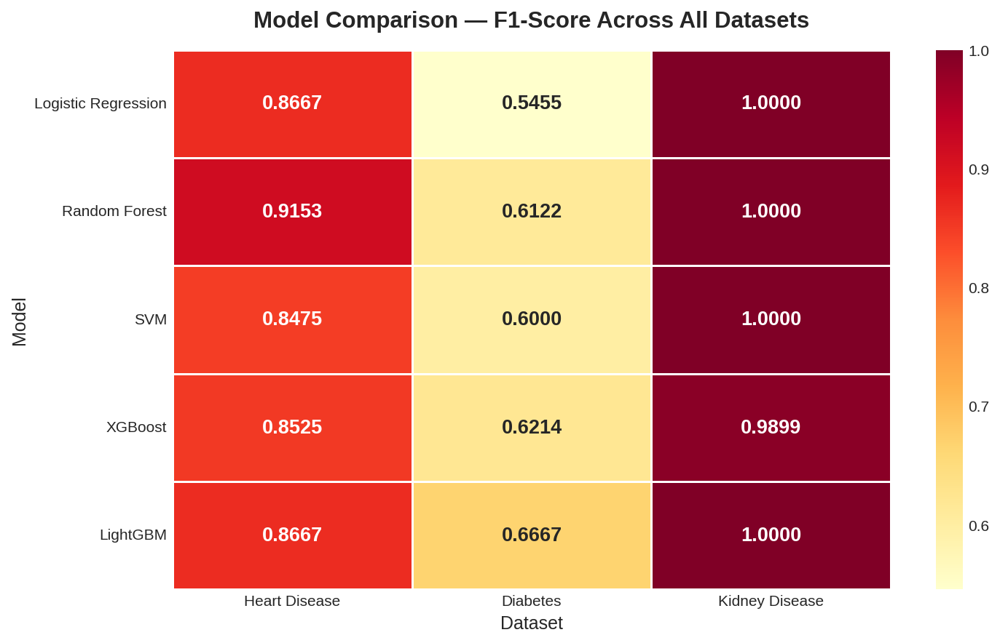
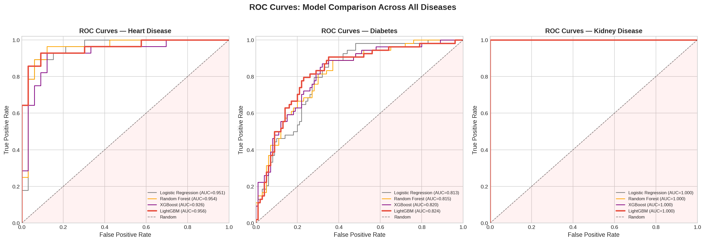
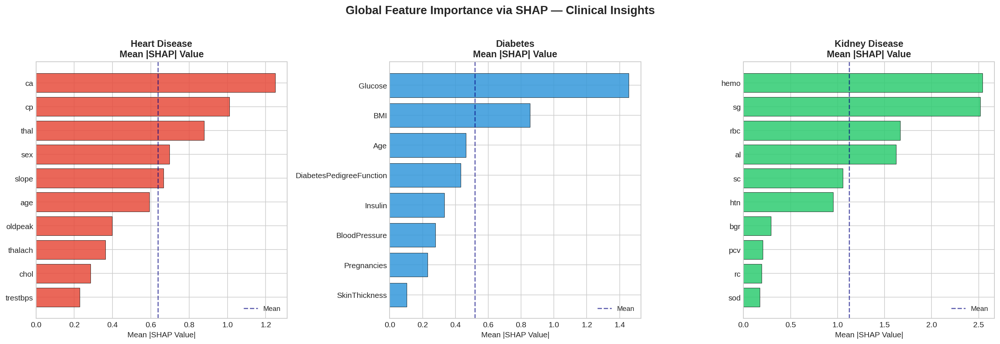
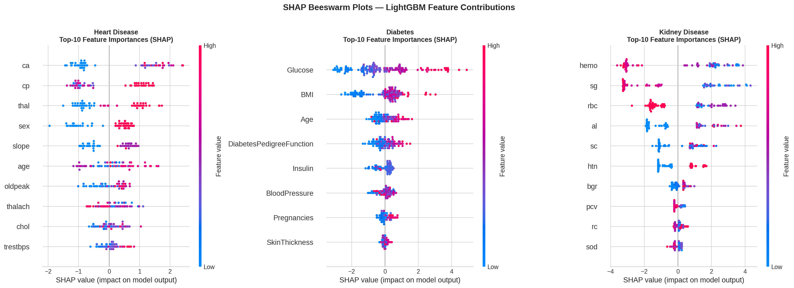
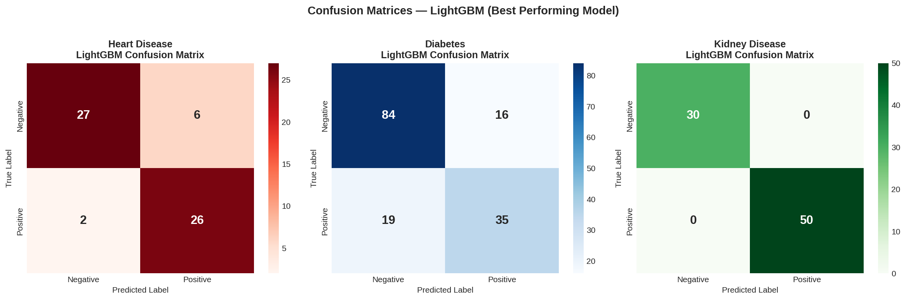
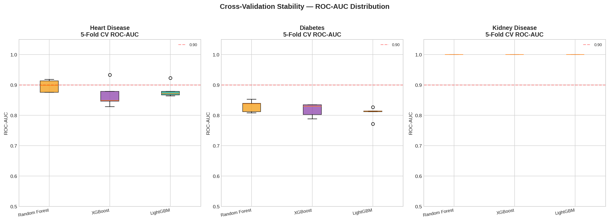

# Comparative Analysis of ML Approaches for Chronic Disease Prediction with SHAP Explainability
## A Multi-Dataset Benchmark

[](https://python.org)
[](https://jupyter.org)
[](https://scikit-learn.org)
[](https://xgboost.readthedocs.io)
[](https://lightgbm.readthedocs.io)
[](https://shap.readthedocs.io)
[](LICENSE)

> **Author:** Muhammad Adeel  
> **Institution:** Virtual University of Pakistan  
> [](https://www.linkedin.com/in/muhammadadeelai/)
> [](https://github.com/adeeljames)

---

## 📄 Research Paper

**"Comparative Analysis of ML Approaches for Chronic Disease Prediction with SHAP Explainability: A Multi-Dataset Benchmark"**

📥 **[Download Paper (PDF)](./Adeel_ChronicDisease_ML_Paper.pdf)**

---

## 🎯 Overview

Systematic comparison of **5 ML classifiers** across **3 chronic disease datasets** with **SHAP explainability**.

| Disease | Dataset | Samples | Features | Best Model | ROC-AUC |
|---------|---------|---------|----------|-----------|---------|
| ❤️ Heart Disease | Cleveland UCI | 303 | 13 | LightGBM | **0.9556** |
| 🩸 Diabetes | Pima Indians | 768 | 8 | LightGBM | **0.8243** |
| 🫘 Kidney Disease | UCI CKD | 400 | 24 | LightGBM | **1.0000** |

---

## 📊 Key Results

### F1-Score Heatmap — All Models × All Datasets


### ROC Curves — Model Comparison Across All Diseases


### SHAP Global Feature Importance — Clinical Insights


### SHAP Beeswarm Plots — Feature Contribution Direction


### Confusion Matrices — LightGBM (Best Model)


### Cross-Validation Stability


---

## 🏆 Models Evaluated

| Model | Type |
|-------|------|
| Logistic Regression | Classical |
| Support Vector Machine (SVM) | Classical |
| Random Forest | Ensemble |
| XGBoost | Gradient Boosting |
| LightGBM | Gradient Boosting |

---

## 🔬 Methodology

```
Raw Data
   ↓
Preprocessing (LabelEncoder + Median Imputation + StandardScaler)
   ↓
Stratified 80/20 Train-Test Split
   ↓
5 Models × 3 Datasets = 15 Experiments
   ↓
Evaluation (Accuracy / Precision / Recall / F1 / ROC-AUC)
   ↓
5-Fold Cross-Validation (Robustness Check)
   ↓
SHAP TreeExplainer (Explainability)
   ↓
Clinical Insight Analysis
```

---

## 📁 Repository Structure

```
chronic-disease-ml-explainability/
│
├── chronic_disease_ml_research_FINAL.ipynb   ← Full research notebook
├── Adeel_ChronicDisease_ML_Paper.pdf         ← Research paper
├── README.md
│
└── results/
    ├── final_results_table.csv
    ├── class_distribution.png
    ├── correlation_heatmaps.png
    ├── heart_distributions.png
    ├── f1_heatmap.png
    ├── roc_auc_comparison.png
    ├── roc_curves.png
    ├── confusion_matrices.png
    ├── shap_beeswarm.png
    ├── shap_global_importance.png
    └── cv_boxplots.png
```

---

## 🚀 Run in Google Colab

[](https://colab.research.google.com/github/adeeljames/chronic-disease-ml-explainability/blob/main/chronic_disease_ml_research_FINAL.ipynb)

```python
!pip install shap lightgbm xgboost -q
```

---

## 📦 Run Locally

```bash
git clone https://github.com/adeeljames/chronic-disease-ml-explainability.git
cd chronic-disease-ml-explainability
pip install pandas numpy matplotlib seaborn scikit-learn xgboost lightgbm shap
jupyter notebook chronic_disease_ml_research_FINAL.ipynb
```

---

## 📈 Full Results Table

| Dataset | Model | Accuracy | Precision | Recall | F1-Score | ROC-AUC |
|---------|-------|----------|-----------|--------|----------|---------|
| Heart Disease | Logistic Regression | 0.8689 | 0.8125 | 0.9286 | 0.8667 | 0.9513 |
| Heart Disease | Random Forest | 0.9180 | 0.8710 | 0.9643 | 0.9153 | 0.9535 |
| Heart Disease | SVM | 0.8525 | 0.8065 | 0.8929 | 0.8475 | 0.9437 |
| Heart Disease | XGBoost | 0.8525 | 0.7879 | 0.9286 | 0.8525 | 0.9264 |
| Heart Disease | **LightGBM** | **0.8689** | **0.8125** | **0.9286** | **0.8667** | **0.9556** |
| Diabetes | Logistic Regression | 0.7078 | 0.6000 | 0.5000 | 0.5455 | 0.8130 |
| Diabetes | Random Forest | 0.7532 | 0.6818 | 0.5556 | 0.6122 | 0.8152 |
| Diabetes | SVM | 0.7403 | 0.6522 | 0.5556 | 0.6000 | 0.7964 |
| Diabetes | XGBoost | 0.7468 | 0.6531 | 0.5926 | 0.6214 | 0.8204 |
| Diabetes | **LightGBM** | **0.7727** | **0.6863** | **0.6481** | **0.6667** | **0.8243** |
| Kidney Disease | Logistic Regression | 1.0000 | 1.0000 | 1.0000 | 1.0000 | 1.0000 |
| Kidney Disease | Random Forest | 1.0000 | 1.0000 | 1.0000 | 1.0000 | 1.0000 |
| Kidney Disease | SVM | 1.0000 | 1.0000 | 1.0000 | 1.0000 | 1.0000 |
| Kidney Disease | XGBoost | 0.9875 | 1.0000 | 0.9800 | 0.9899 | 1.0000 |
| Kidney Disease | **LightGBM** | **1.0000** | **1.0000** | **1.0000** | **1.0000** | **1.0000** |

---

## 🧠 SHAP Clinical Insights

| Disease | Top Feature | Clinical Meaning |
|---------|------------|-----------------|
| ❤️ Heart Disease | `ca` — vessels blocked | Direct marker of coronary artery obstruction |
| ❤️ Heart Disease | `cp` — chest pain type | Primary symptom for cardiac triage |
| 🩸 Diabetes | `Glucose` | Definitional diagnostic criterion |
| 🩸 Diabetes | `BMI` | Key modifiable risk factor |
| 🫘 Kidney Disease | `hemo` — hemoglobin | Hallmark of CKD progression |
| 🫘 Kidney Disease | `sg` — specific gravity | Reflects kidney concentrating ability |

---

## 📚 Citation

```bibtex
@misc{adeel2026chronic,
  title   = {Comparative Analysis of ML Approaches for Chronic Disease 
             Prediction with SHAP Explainability: A Multi-Dataset Benchmark},
  author  = {Muhammad Adeel},
  year    = {2026},
  url     = {https://github.com/adeeljames/chronic-disease-ml-explainability}
}
```

---

## 📜 License

MIT License — free to use with attribution.

---

<p align="center">
  Made by <a href="https://www.linkedin.com/in/muhammadadeelai/">Muhammad Adeel</a> · Virtual University of Pakistan
</p>
